# TryHackMe: Jurassic Park (Write-Up)

## 🛡️ Introduction

Hey! I'm Madhav and I love learning about hacking. This is the write up for a room named Jurrasic Park on [TryHackMe](https://tryhackme.com/room/jurassicpark), it's is a hard level so that's why it took a little help from some public writeups but I'm proud to say I did most of the stuff.

## 🎯 Challenge Overview

The target is a Jurassic Park theme based web app, it had the functionality to see prices of packages for the tour of the jurassic park and not really anything else.

- Objective: Obtain the user and root flag.
- Techniques: Directory Bruteforcing, UNION-Based SQLi, Linux Privesc through the scp binary

## 🔍 Methodology & Exploitation

### 1. Initial Scan

So let's just fire nmap and see what ports are open

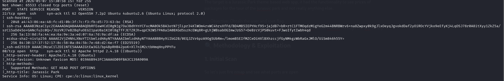

So just 2 ports are open 22 (ssh) and 80 (http), well I knew that there would be a web app as the questions on the page indicated SQLi. So let's go and see the web page.

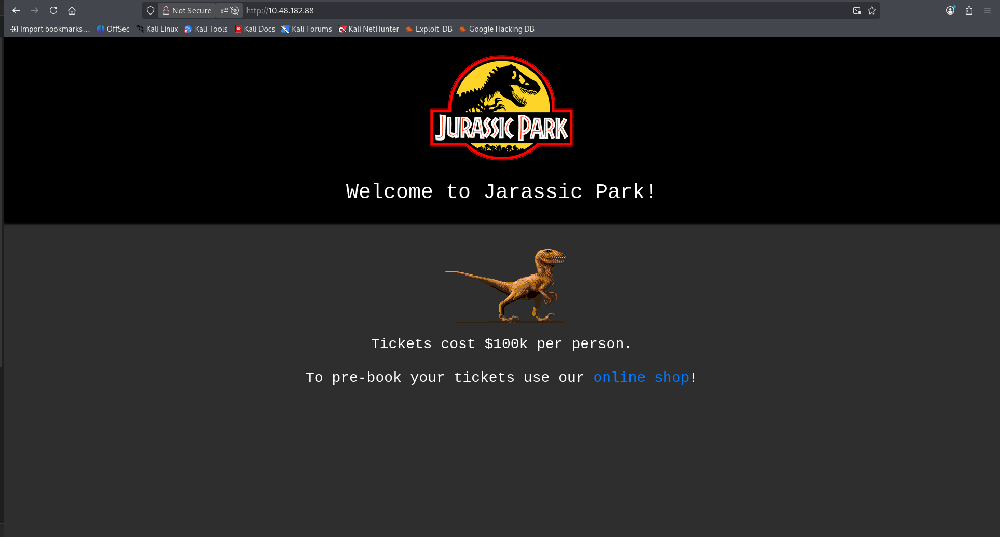

Ok we have a web page, now let's run gobuster to see some directories and increase our attack vectors.

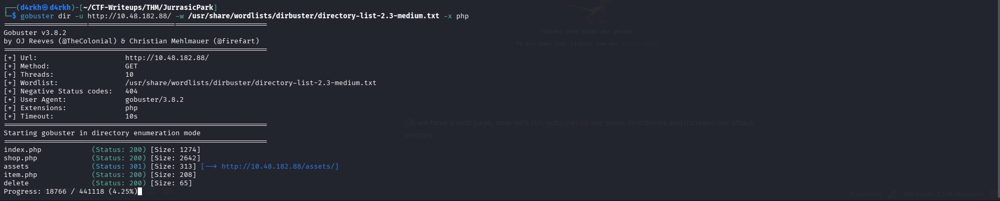

Oh! we found a 'delete' directory, this sounds interesting let's check it out!

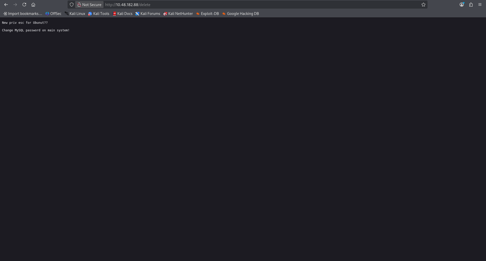

YEAH! looks like it's some kind of message from the API or something, but it sure indicates that the dbms used is MySQL, Great! So spoiler alert, I did waste a lot of time here but unfortunately wasn't able to find anything maybe I missed something or it was there to just waste time of the user or maybe it's a different way which I couldn't exploit, so I moved onto the main web page and started looking into that.

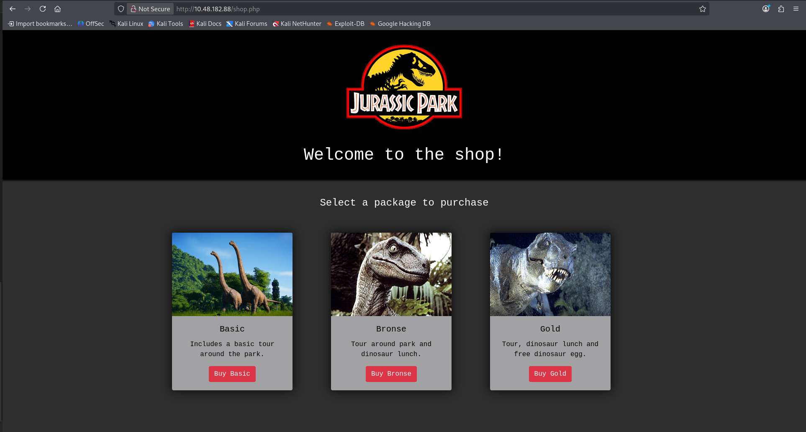

Let's just click on a package and see what comes up.

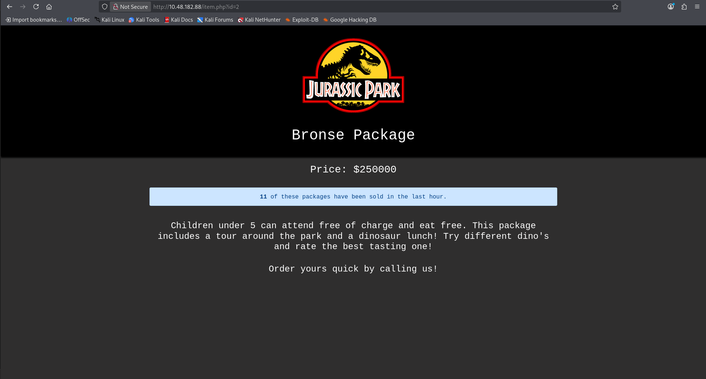

Ooh! Jurassic park sure is really expensive! well keeping that aside, I noticed an 'id' get parameter and started to tinker with that for IDOR but then I thought that the questions were about SQLi so I just put a ' to test and BOOM! it's SQL injection through the 'id' get parameter on item.php. It said permission denied and dared me to use 'sqlmap', I didn't use sqlmap I just tried some payloads.

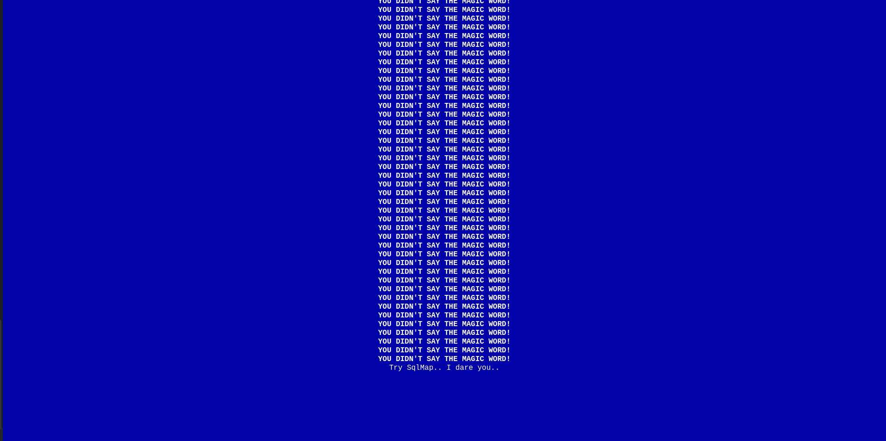

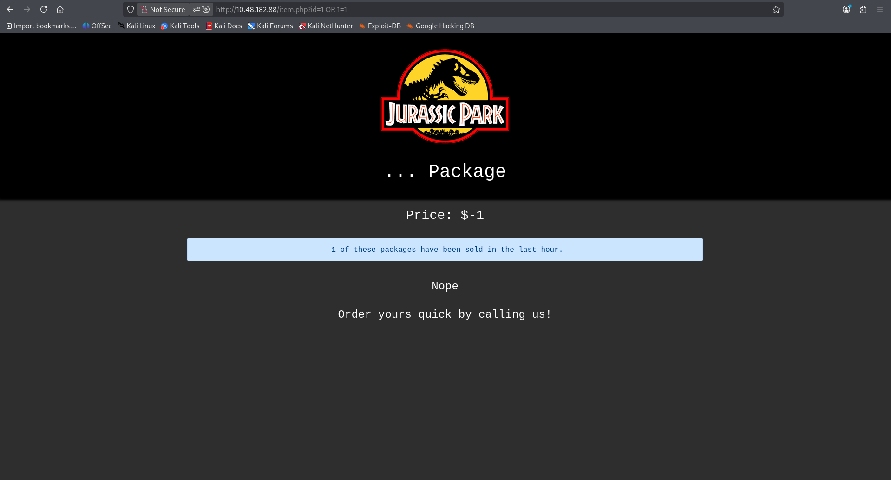

Yeah! so we got the right way to exploit this, It's a Numeric-Based SQL injection. Now we just have to dump information from the db to answer the questions on the tryhackme page.

#### What is the name of the SQL database serving the shop information?

We can get the name of the database serving the shop information using the following payload in the 'id' get parameter : 1 UNION SELECT 1,database(),3,4,5

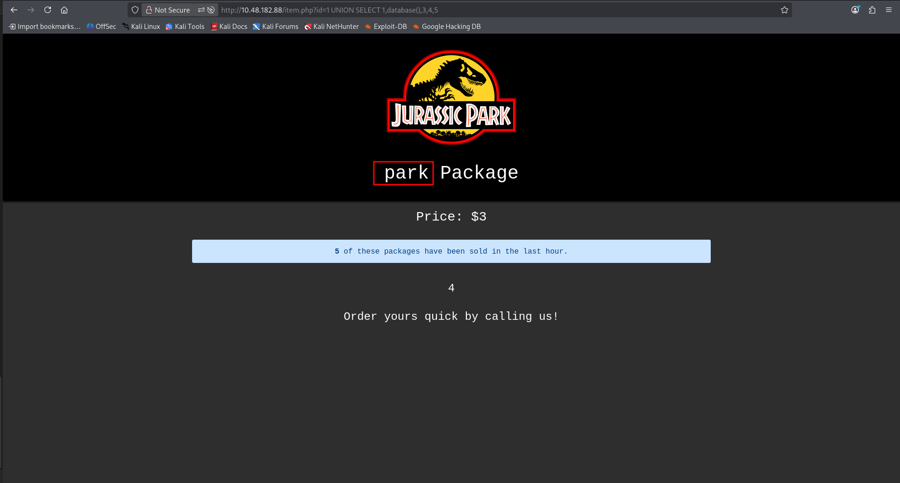

Ans: `park`

#### How many columns does the table have?

It is talking about the number of columns in the table `users`. 

Ans: `5`

#### What is the system version?

We can get the system version using the version() function in SQL, here is the payload used to get that : 1 UNION SELECT 1,version(),3,4,5

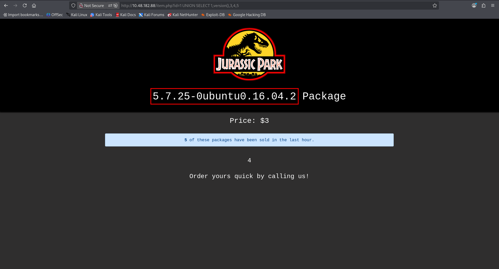

Ans: `Ubuntu 16.04`

#### What is Dennis' password?

We can get Dennis's password by using the following SQL query in the 'id' get parameter, it was actually the only password in the database : 1 UNION SELECT 1,password,3,4,5 FROM users

![dennis-pass][dennis-pass.png)

Ans: `REDACTED`

Hey! we got the password for the user Dennis, let's login as him and get the 1st flag

### SSH as Dennis

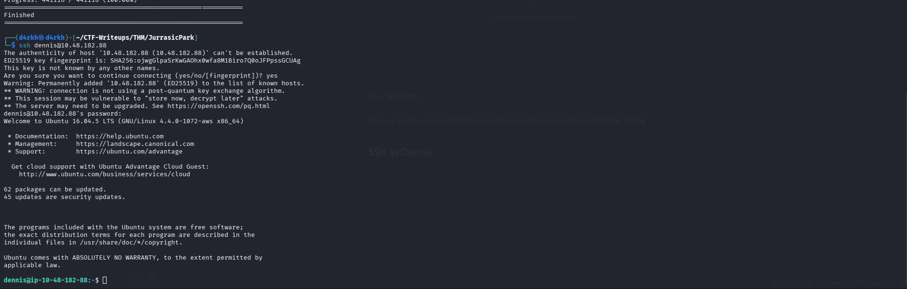

Yeah! we got initial access, here's the 1st flag

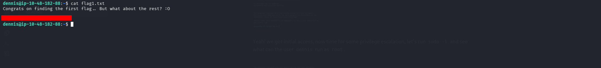

Now time for some privilege escalation, let's run `sudo -l` and see what can the user `dennis` run as `root`. 

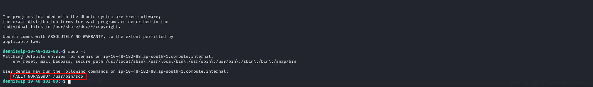

Well looks like privilege escalation would be a peace of cake here, first I thought I'll just get the `/etc/shadow` file on my system and crack the hash but I thought it would have been really time consuming and unnecessary then I remembered that `gtfobins` exist! So let's just look up on `gtfobins` about `scp` . I found this payload working great for me 

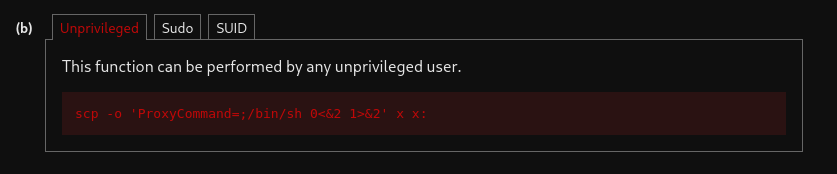

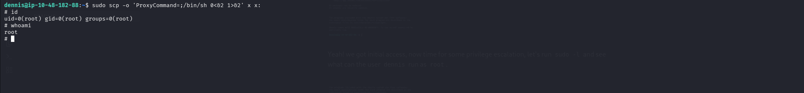

Well I thought we will get all the flags sequentially but I just got root so ig just print all the flags and get it over with! I first stabilised the shell using python as it was really messy. Let's find the 2nd flag.

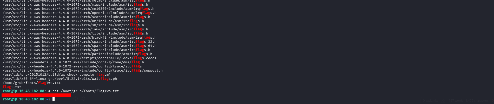

The  3rd flag, I got that it in the `.bash_history` file of the `dennis` user

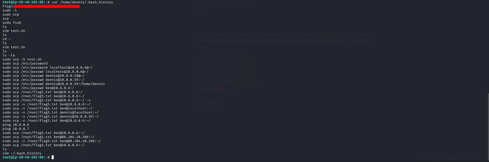

And there is no flag 4, for some reason it's directly flag 5 and it was in the `root` directory:

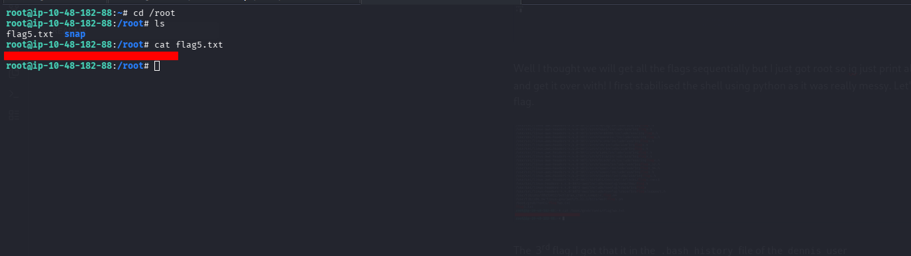

So with that the room Jurassic Park is complete!!!

# Flags Location:

## 1st Flag : `/home/dennis/flag1.txt`
## 2nd Flag: `/boot/grub/fonts/flagTwo.txt`
## 3rd Flag: `/home/dennis/.bash_history`
## 5th Flag: `/root/flag5.txt`

