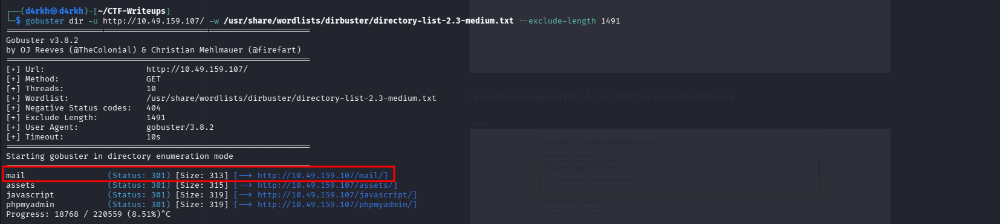
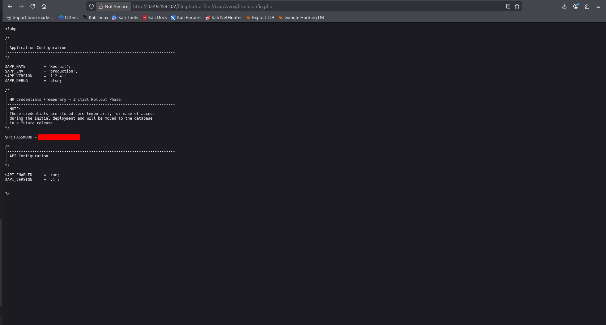
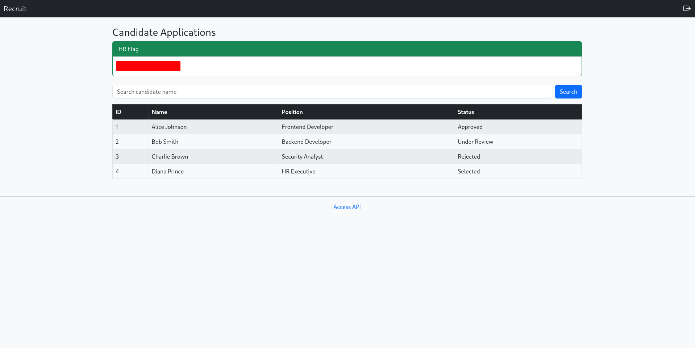
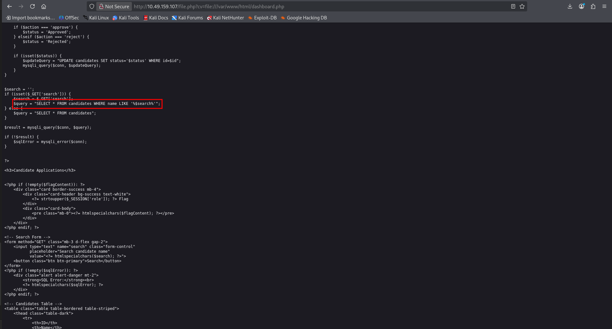
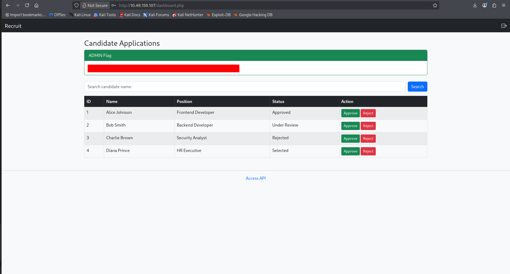

# TryHackMe: Recruit Web Challenge (Write-up)

## 🛡️ Introduction
Hey! I'm Madhav, a cybersecurity enthusiast and student. This write-up covers my manual exploitation of the **Recruit** room on TryHackMe. This was a particularly rewarding challenge as I completed it without any external write-ups, focusing on manual enumeration and exploitation techniques.

**Room Link:** [Recruit](https://tryhackme.com/room/recruitwebchallenge)  
**Difficulty:** Medium

---

## 🎯 Challenge Overview
The target is a web application named **Recruit**, designed for HR departments to manage applicant CVs. The end goal was to escalate privileges and gain administrative access.

*   **Objective:** Obtain the User and Root flags.
*   **Techniques:** Directory Bruteforcing, Local File Inclusion (LFI/SSRF), and Manual Union-Based SQL Injection.

---

## 🔍 Methodology & Exploitation

### 1. Initial Reconnaissance
Upon navigating to the target IP, I identified two primary entry points:
1.  A standard **Login Form**.
2.  An **Access API** documentation link.

I performed directory brute-forcing using `gobuster` to find hidden paths:

I discovered a `/mail` directory containing a `mail.log` file. Analyzing this log revealed a username `hr` and a hint that the password was stored in the server's `config.php` file.

### 2. Exploiting the Access API (LFI/SSRF)
The "Access API" documentation showed an endpoint that supports fetching external URLs. I tested for **Server-Side Request Forgery (SSRF)** and **Local File Inclusion (LFI)**. 

While certain filters were in place, I was able to successfully request the local `config.php` file through the API:

**Result:** Obtained the cleartext password for the `hr` user.

### 3. Privilege Escalation: Horizontal (Login as HR)
Using the discovered credentials, I logged in as the `hr` user and captured the first flag.

### 4. Advanced Exploitation: Manual SQL Injection
The dashboard featured a search bar to filter candidates. I immediately tested for **SQL Injection (SQLi)** by inputting a single quote `'`. The server returned an **Error-Based SQLi** response, confirming the vulnerability.

To build a precise payload, I used the Access API again to read the source code of `dashboard.php`, allowing me to see the exact SQL query structure:

#### The Breakthrough
Standard payloads using `--` for comments failed. Through manual testing, I realized the backend was using `#` for commenting. I then moved to a **Union-Based SQLi** to dump the database:

1.  **Table Enumeration:** Identified the `users` table.
2.  **Data Extraction:** Dumped the `administrator` credentials.

### 5. Final Escalation: Vertical (Admin Access)
With the administrator credentials in hand, I logged into the admin panel and successfully retrieved the root flag.

---

## 📝 Summary of Vulnerabilities

### Access API (LFI/SSRF)
*   **Vulnerability:** Improper input validation on the API endpoint.
*   **Impact:** Allowed unauthorized reading of local configuration files (`config.php`) and server-side source code (`dashboard.php`).

### Search Functionality (SQL Injection)
*   **Vulnerability:** Unsanitized user input in the candidate search bar.
*   **Impact:** Allowed for a full database dump, leading to a complete takeover of the administrator account.

---
*Created by Madhav Purohit - 2026*
